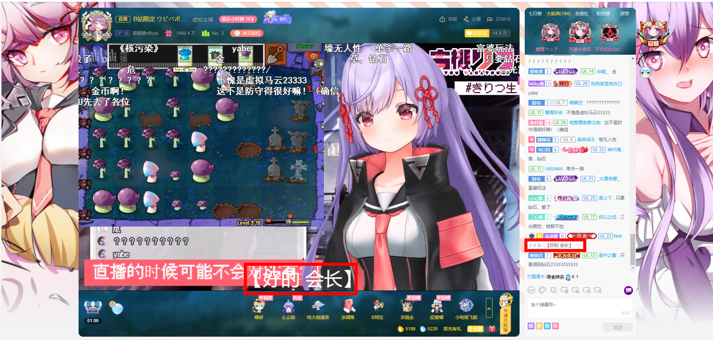
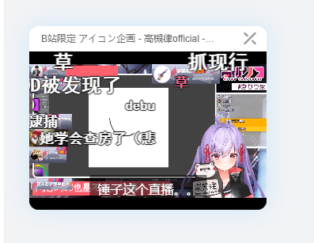
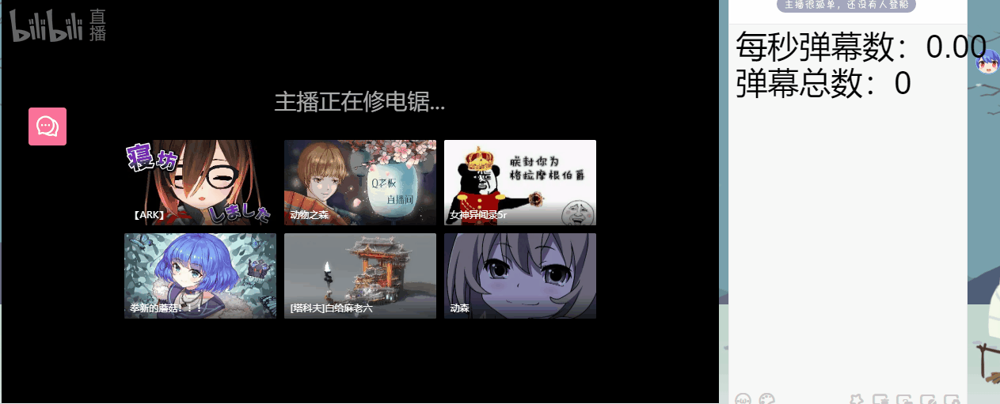

# bilibiliVtuberLiveTool
b站(bilibili) vtuber直播，同传字幕绑定器--油猴脚本。关注同传man后，可以将同传评论显示在视频底部

## 目录
[脚本特性](#脚本特性)  
[使用方法](#使用方法)  
[更新计划](#更新计划)   
[压力测试](#压力测试)   
[说明](#说明)  

## 脚本特性
### 捕获同传man的评论，以类底部弹幕的形式显示,自动去括号。
 
### 支持全屏/小窗使用

### 新增可视化配置界面([更新为滚动/拖动](web/9.gif))

### 新增翻译功能  
  
翻译使用有道API，不保证翻译准确性...  

## 使用方法
### 安装
* 前往Greasy Fork安装脚本,[点击此处](https://greasyfork.org/zh-CN/scripts/398879-b%E7%AB%99vtuber%E7%9B%B4%E6%92%AD%E5%90%8C%E4%BC%A0%E8%AF%84%E8%AE%BA%E8%BD%AC%E5%AD%97%E5%B9%95)
### 关注同传man
* 打开直播页面后，点击评论区同传man用户名，在弹出菜单中点击最下方的 **添加字幕特别关注**  
  
* 注：脚本可以添加多个同传man，重复上一步操作即可

### 字幕样式设置
* 更改字幕位置：鼠标拖动
* 更改字体大小：鼠标悬停在字幕上方，滚动滚轮
* **注：如果不小心把字体调的太小选不中，或者因为将字体拖到太靠下的位置导致被工具栏挡住，可以在配置面板重置字幕样式**
### 翻译功能
* **如果您需要使用翻译功能，请至少打开一次[有道翻译(点击此处连接直达)](http://fanyi.youdao.com/?keyfrom=dict2.index)，并随便翻译点什么，之后翻译功能就能够正常使用了。如果有道翻译警告请求频繁，不需要等待，清除有道Cookie后直接翻译即可。浏览器清除指定网站cookie的方法：**
>> Chrome:地址栏左侧锁图标-Cookie-Youdao.com-删除  
>> Firefox:鼠标右键单击网站-查看网页信息-安全-清除Cookie和网站数据-youdao.com-移除

 ## 更新计划
- [ ] 添加各类功能的开关，避免切换到非vtuber直播间后需要关闭插件
- [ ] 添加同传man评论历史记录窗口
- [ ] 未来计划用Google、Azure或者有道的实时翻译接口或者语音识别接口实现实时翻译（之所以脚本都是调接口，毕竟这是人家吃饭的东西，自己写的模型充其量算是个爱好），但是最近读论文有些忙，具体什么时候实现还得待定
- [x] 计划在评论栏添加中文转日文功能，帮助不懂日语的小伙伴和vtuber互动(计划使用youdao APi)
- [ ] ~~保存关注的同传man~~
- [x] 添加可视化的字幕颜色、大小修改面板。
- [x] 添加自由拖动字幕位置的功能。
 ## 压力测试
 有人跟我提了一下高峰期直播间弹幕的问题，所以我去做了一下压力测试(因为不清楚MutationOberver的实际性能)。
 * 测试方法：模拟同传man，从0数到100，期间加入压力测试，逐渐增加弹幕频率，看脚本是否会漏掉模拟同传man的评论。
 * 测试结果：将弹幕频率提升到Chrome浏览器极限后，脚本依旧不会漏掉同传man评论，说明MutationOberver的性能没有那么不堪。(Chrome浏览器弹幕速度的极限取决于DOM刷新频率，在每秒920条弹幕频率就无法提升了)
 * 测试过程：  
 测完了才想起来，Mutation如果是回调事件应该是阻塞式的，理论上就不可能漏掉弹幕...是自己蠢了。
 ## 说明
* 如果您有任何问题、意见或建议，请直接发issue。  
* 如果您有什么需要的功能，包括但不限于看直播时需要的功能，同时也找不到现成的插件，也可以在issue中提出来。
* 请不要在greasyfork发反馈，gf的反馈看不到。
